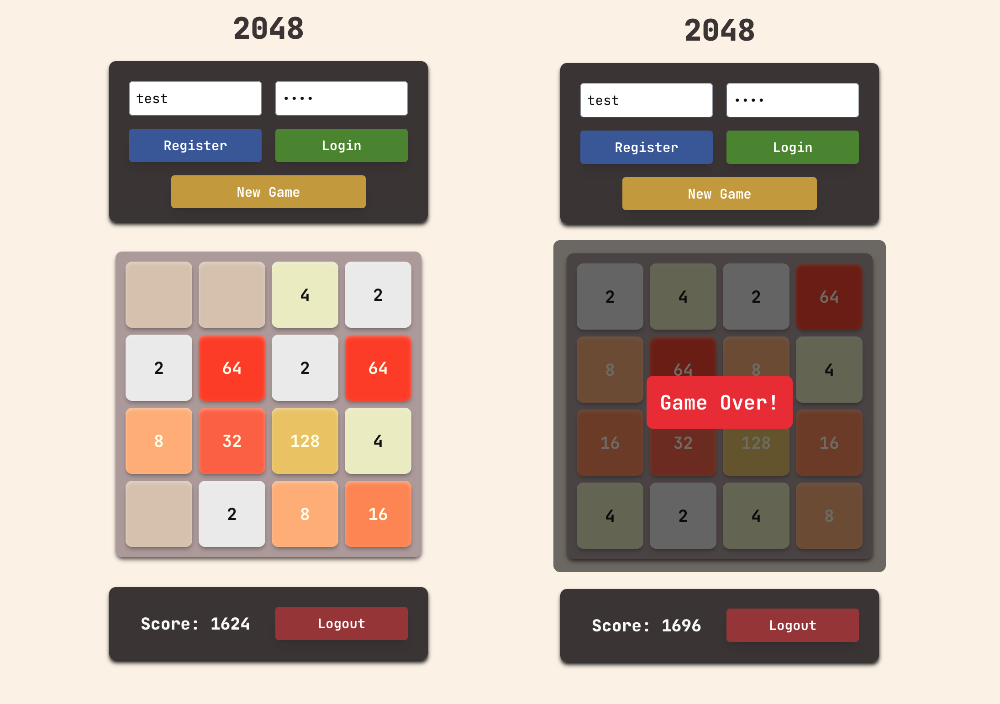
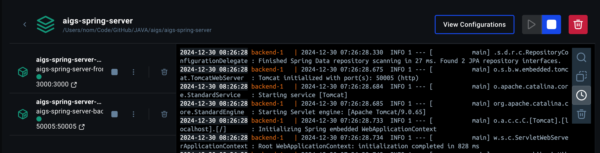
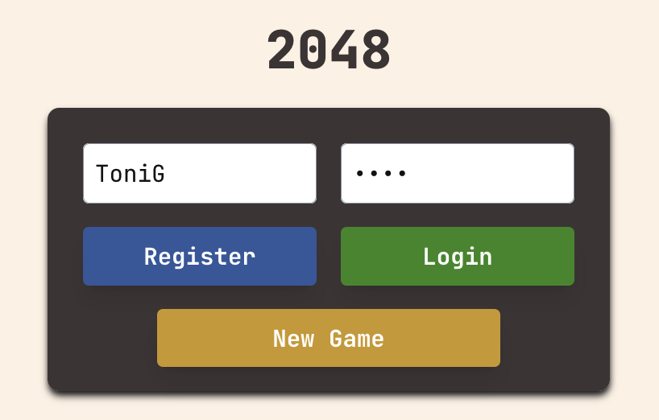
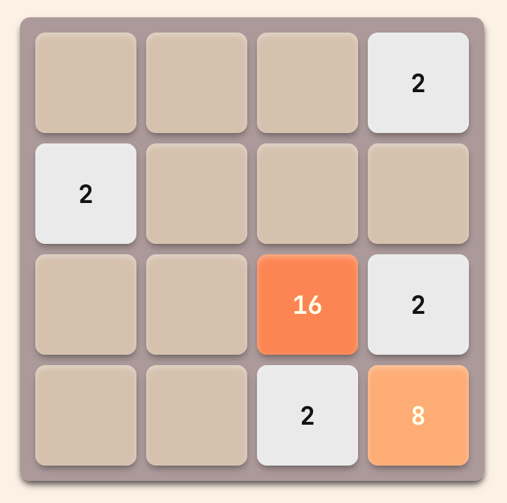
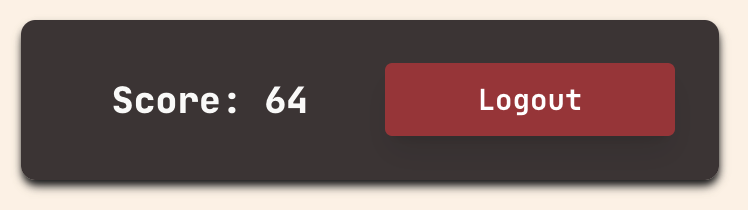
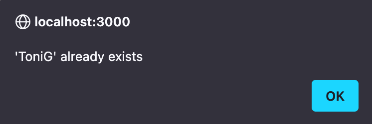

# AIGS Project Documentation 
FHNW 2024 - AI Game Service (Software Engineering)

### Project Contributors
👨🏽‍💻 Manuel Notter

### Project Description
AIGS is a fully implemented gameserver. The initial server was supporting one game: TicTacToe. The repository of the original server as well as the client for TicTacToe can be found here:

Server repository: [Server Repository](https://gitlab.fhnw.ch/bradley.richards/aigs-spring-server) 
Client repository: [Client Repository](https://gitlab.fhnw.ch/bradley.richards/aigs-game-clients)

### Project Objective

The objective of this project was to extend the existing project by creating a client for an existing game, develop an entirely new game, or reimplement the game-server. As the last option would have been to big of a task, I chose to implement a new game for the game server and develop a frontend client to play the game.

## The Game: 2048

2048 is a single-player sliding block puzzle game. The game's objective is to slide numbered tiles on a grid to combine them to create a tile with the number 2048. 

<p align="center">
  
</p>

The game is won when a tile with the number 2048 appears on the board, hence the name of the game. The game is lost when the player has no legal moves left to make, resulting in the game board being full. 

In the current iteration of the game, 2048 is not defined as a win condition. The game is over, when the board is full and no more moves can be made. At that point, the score is calculated and the game is over.

## Demo GIF
<p align="center">
  
</p>

## Running the Project

To run the project in demo mode, both the frontend and backend are needed. Currently, there is no way to specify the game server. The API of the server is hardcoded in the API utility class.

The project can be either run in development mode or 'production mode'. To run the project in development mode, the Java backend and the next.js frontend can be run seperately (Maven / npm).

For demonstration purposes, a `docker-compose.yaml` file is provided.

Simply clone the repository and run the **following command** in the `agis-spring-server` directory of the project:

```shell
docker-compose up --build
```

To run the docker-compose file, **docker** and **docker-compose** need to be installed on the machine. 
The frontend will be available on 'localhost:3000'.

Docker-Compose has been tested on MacOS Sequoia and Fedora 41. When initially running the command, it might take a while to build the images and start the containers. 

For Linux `sudo` might be necessary to run Docker-Compose. 

If for any reason the Docker build should fail, run the **following commands** in the `aigs-react-client` directory and start the Java backend from the CLI or with your IDE/Editor.

```shell
npm install
```
```shell
npm run dev
```

<p align="center">
  
</p>


## General Remarks

## Application Structure

The Game is a simple single-page application structured in the following way: 

### Top Controls
<p align="center">
  
</p>

Top controls are used to register a new user, login to the server, and start a new game. It is not possible to register a user, that is already registered. Although the server responds with an 200 OK, the user can't be registered twice, which is displayed in an alert. When logging in as an already logged in user, a new token is generated. When starting a new game, the game new gameboard is fetched from the server and the score is reset to 0.

### Game Board
<p align="center">
  
</p>

The game is played by pressing on the arrow keys on the keyboard. Because the state of the board is calculated on the server, no 'nice' animations are implemented in the frontend.
Illegal moves are not possible: When moving to a certain direction and it's not possible to do so, the server just responds with the same board as before.

### Bottom Control & Score
<p align="center">
  
</p>

At the bottom, an additional button is used to logout again. When logging out, the username and password fields are reset, the token is deleted, the gameboard is reset and the score is set to 0.
Users are not persisted on the server after restarting the program. When simply logging out, a user will be able to log in again with the same credentials.

### Alerts
<p align="center">
  
</p>

Browser alerts are used to display information about failed or successful actions.

## Implementation
The implementation is split into two parts: The frontend and the backend. The frontend is implemented with Next.js, a React framework. The backend is implemented with Spring Boot (which has already been done in the original project), and is extended with new game logic for the 2048 game.

### Spring Backend - New Game Logic

The first step was to add an Enum for the new game type, which was pretty straightforeward. Normally in Java, packages are written in lowercase, classes are written in CamelCase and Enums are written in UPPERCASE. 
So I wanted to refactor but noticed, that the server was not working correctly anymore. After debugging, i found that the enum as well as the classname need to have the same value. I did not bother to refactor the code and just left it as it is. This could be improved in the future.

The next step was to implement the game logic. I have created a new Class called TwentyFourtyEight.java which implements GameEngine. I needed to implement the `newGame()` method as well as the `move()` method.
I also wanted to have a score for the game, so I added an instance variable for score. I did not yet know how to return the score and postponed it to a later point.

The `move()` method accepts a `Game` and a `HashMap<String, String>` with the move instructions.
For 2048, the move instructions are simple: just a direction.

```java
String right = "right";
String left = "left";
String up = "up";
String down = "down";

if (move.get(KEY).equals(right)) {
    game.setBoard(moveRight(oldBoard));
} else if (move.get(KEY).equals(left)) {
    game.setBoard(moveLeft(oldBoard));
} else if (move.get(KEY).equals(up)) {
    game.setBoard(moveUp(oldBoard));
} else if (move.get(KEY).equals(down)) {
    game.setBoard(moveDown(oldBoard));
}
```

But before we can move, we need a board and a method to initialize the board. I just inizialized the `long[][] board` with a size of 4x4 and filled it with zeros. 

The challenging part was the moving of the numbers as well as the consolidation according to the game rules of 2048. I chose to create a Data Transfer Object to store certain values for further processing.

```java
public class MoveDTO {
private long[] row;
private int score;

public MoveDTO() {
    this.score = 0;
}
```

I thought it would be easier to work with one-dimensional arrays, so i chose to store a single row in each DTO. I also wanted to transfer the 'local score' of each row, so I included it in the dto.

Next I needed a method to consolidate the numbers to the end of a row, to the beginning of a row, to the end of a column and to the beginning of a column to cover all directions. The good thing was, because I chose work in one dimension, no matter if the consolidation is horizontal or vertical, it is always either consolidation to the start, or to the end -> two methods for all 4 directions.
This was pretty tricky to implement correctly, I therefore created some tests to ensure proper functioning of the code. The tests are not providing full coverage, but they were sufficient for my use case.
After each consolidation, i return a DTO with the updated array.

```java
MoveDTO consolidateToStart(long[] row) {
    MoveDTO moveDTO = new MoveDTO();
    long[] temp = Arrays.copyOf(row, row.length);
    int localScore = 0;

    // Join tiles if they are equal and adjacent or separated by 0.
    int j;
    for (int i = 0; i <= 2; i++) {
        for (j = i + 1; j <= 3; j++) {
            if (row[i] == 0) {
                break;
            } else if (row[i] == row[j]) {
                temp[i] = row[i] * 2;
                temp[j] = 0;
                row[j] = 0;
                localScore += temp[i];
                break;
            } else if (row[j] != 0) {
                break;
            }
        }
    }

    // Update the row with the new values and positions and reset the temp array.
    row = Arrays.copyOf(temp, temp.length);
    temp = new long[4];

    // Move the tiles to the start
    int count = 0;
    for (int i = 0; i <= 3; i++) {
        if (row[i] == 0) {
            count++;
        } else {
            temp[i - count] = row[i];
        }
    }

    moveDTO.setRow(temp);
    moveDTO.setScore(localScore);

    return moveDTO;
}
```

Finally, I needed to implement the move methods for each direction, implement a method to check for game over and implement the calculation of the score. As for every move a new Game object is created, i needed to set the score instance variable for each move and add the new score to the old score.
I still needed a method to relay the score to the frontend, which was a bit tricky. As the Game does not have a method to return the score, I did not want to use reflection and I wanted to avoid updating the controller, I chose to use the existing difficulty variable to store the score. The difficulty is not used in my implementation of the game - and in a sense it is the 'difficulty' reached by the player. It could have been solved differently, but I wanted to not break compatibility. The best solution would have been to update the Game class and add a new method there.

### Next.js Frontend
The next step was to create the frontend for the game. I chose to use Next.js, a React framework, as I am already a bit familiar with it.
First i needed to test the API. I therefore created a `2048.http` file in the spring-server package with the important API calls and tested if all was working as expected.

The project is a single page application with two main files, the `layout.tsx` and `page.tsx`. In `layout.tsx` I only added the Title, Description and added a new Google Font. I also changed the background of the application in `globals.css`.

The main part of the application is `page.tsx`, a react component that renders the game interface. I chose to use a single component for most of the game interfase, and only implemented the gameboard as a separate component. 

In the HomePage component, I use React's state to manage the board, username, password, a token, the score and the game over state. 

```ts
const HomePage: React.FC = () => {
  const [board, setBoard] = useState<number[][]>(Array(4).fill(Array(4).fill(0)));
  const [username, setUsername] = useState('');
  const [password, setPassword] = useState('');
  const [token, setToken] = useState('');
  const [isGameOver, setIsGameOver] = useState(false);
  const [score, setScore] = useState(0);
```

The API calls are implemented in the `api.ts` file.

```ts
import axios from 'axios';

const API_URL = 'http://localhost:50005';

export const registerUser = async (username: string, password: string) => {
  const response = await axios.post(`${API_URL}/users/register`, {
    userName: username,
    password: password,
  });
  return response.data;
};
```

I imported the API calls to the `page.tsx` file.

```ts
import { registerUser, loginUser, startNewGame, makeMove } from './utils/api';
```

I defined different functions to handle the API calls, the user input and the game logic provided by the server.

```tsx
const handleRegister = async () => {
  try {
    const data = await registerUser(username, password);
    if (data.userExpiry) {
      alert('Registration successful! User: ' + data.userName);
    } else if (data.error_description)
      alert(data.error_description);
  } catch (error) {
    console.error(error);
    alert('Registration failed!');
  }
};
```

Finally I returned the TSX code to render the game interface.
For the colors i have used the colors of the original game, which I have found in a React implementation of the game by [IvanVergiliev](https://github.com/IvanVergiliev/2048-react/blob/master/src/main.scss).

For the React part of the game, I have used the help of Copilot, as I am not entirely familiar with the framework. But with each implementation that I am able to do, I get more and more familiar which is great. 

Overall, the project was a lot of fun and I enjoyed learning more about React as well as gaining experience working with Java.


